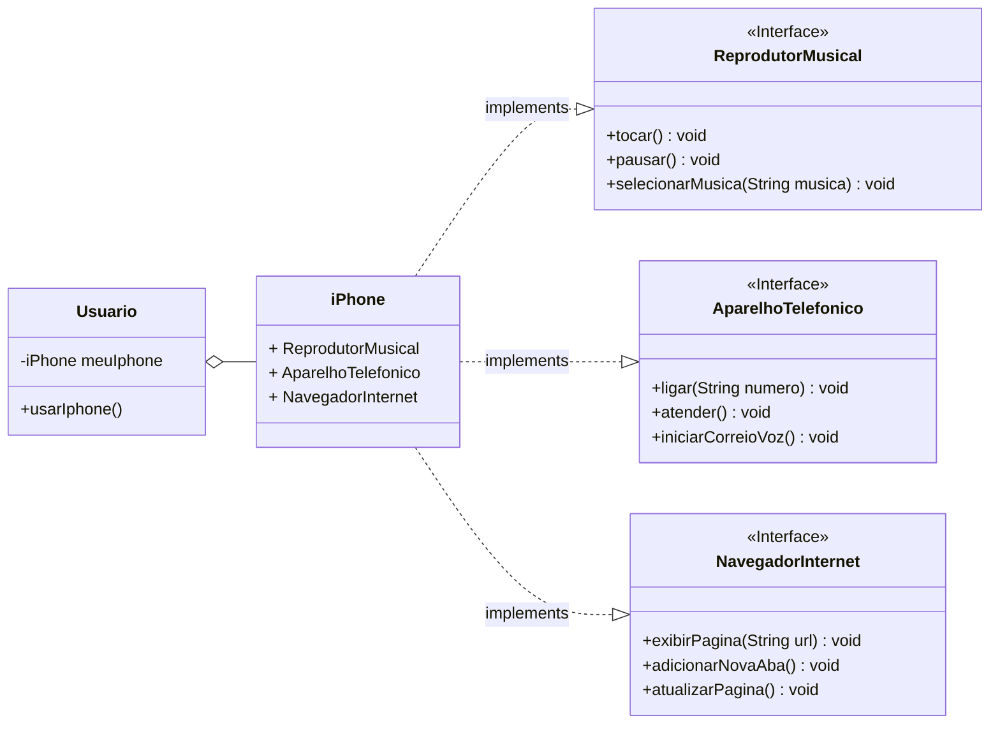

```mermaid
classDiagram
    direction LR

    class ReprodutorMusical {
        <<Interface>>
        +tocar() void
        +pausar() void
        +selecionarMusica(String musica) void
    }

    class AparelhoTelefonico {
        <<Interface>>
        +ligar(String numero) void
        +atender() void
        +iniciarCorreioVoz() void
    }

    class NavegadorInternet {
        <<Interface>>
        +exibirPagina(String url) void
        +adicionarNovaAba() void
        +atualizarPagina() void
    }

    class iPhone {
        + ReprodutorMusical
        + AparelhoTelefonico
        + NavegadorInternet
    }

    iPhone ..|> ReprodutorMusical : implements
    iPhone ..|> AparelhoTelefonico : implements
    iPhone ..|> NavegadorInternet : implements

    class Usuario {
        -iPhone meuIphone
        +usarIphone()
    }
    Usuario o-- iPhone
```    